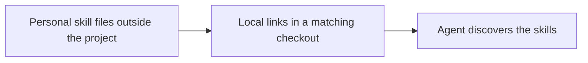
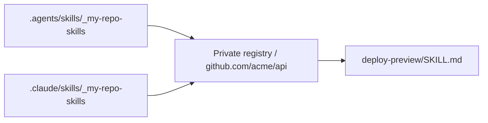
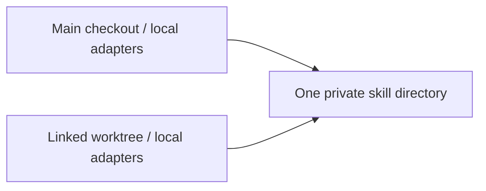

# 1 My Repo Skills

A four-minute explanation for developers who use coding agents.

Open `index.html` in a browser. Use the arrow keys to change slides and N to show speaker notes. The first-person script below expresses the purpose documented in the README. It does not claim a particular incident led to the project.

## 1a Personal skills for a particular repository

About 35 seconds.

"I built My Repo Skills to keep my personal agent instructions outside a project while making them available when I work on that project. A skill is a directory with a SKILL.md file that tells an agent how to handle a task. Some instructions belong to the whole team. Others describe how I want to work with a particular repository. Those personal instructions need somewhere to live, and the agent needs a way to find them."



Source: [README, purpose and mechanism](https://github.com/henriquebastos/my-repo-skills/blob/dc790fb7e6d3a193b8850454569b3881feafe292/README.md#my-repo-skills).

## 1b A private directory for each repository

About 35 seconds.

"I put those skills in a directory I control. Each repository gets a path made from its host, owner, and repository name. In this example, the API repository has a deploy-preview skill. The skill stays outside the project. The implementation can be public, while my skill files stay on my machine or in storage I manage separately. Setting up My Repo Skills means sourcing one Zsh file and creating the skill directories I want."

```text
~/.config/agents/my-repo-skills/skills/
└── github.com/
    └── acme/
        └── api/
            └── deploy-preview/
                └── SKILL.md
```

The paths in this talk are examples from the README. `MY_REPO_SKILLS_DIR` can override the default registry location. "Private" describes where you keep the files. The tool does not encrypt them or configure access permissions.

Source: [README, adding a skill](https://github.com/henriquebastos/my-repo-skills/blob/dc790fb7e6d3a193b8850454569b3881feafe292/README.md#add-a-repository-skill).

## 1c The Git remote identifies the repository

About 40 seconds.

"When I enter a checkout, a Zsh directory-change hook runs the reconciler. It reads all configured Git remote URLs, including upstream. An SSH URL and an HTTPS URL for the same repository become the same directory identity. The reconciler looks for that identity in my private directory. The name of my local checkout does not matter. If exactly one skill directory matches, it connects that directory to the checkout. If several different directories match, it reports an error."

```mermaid
flowchart LR
    S[git@github.com:acme/api.git] --> I[github.com/acme/api]
    H[https://github.com/acme/api.git] --> I
    I --> R[Look up identity inside the private registry]
```

Source: [normalization and matching](https://github.com/henriquebastos/my-repo-skills/blob/dc790fb7e6d3a193b8850454569b3881feafe292/bin/my-repo-skills-reconcile), [shell hook](https://github.com/henriquebastos/my-repo-skills/blob/dc790fb7e6d3a193b8850454569b3881feafe292/zsh/my-repo-skills-reconcile.zsh).

## 1d Two symlinks make the skills discoverable

About 50 seconds.

"The connection is two symbolic links. Both point to the same repository directory in my private registry. One appears under .agents/skills, which the README identifies as the discovery path for Pi, Codex, Amp, and compatible tools. The other appears under .claude/skills for Claude Code. The reconciler also adds the exact link paths to Git's local exclude file. The agent can discover the skill files, and the links stay out of normal git status. Editing a skill changes the original file that both links point to."



Arrows show symbolic-link targets. The agent performs skill discovery. The reconciler creates filesystem links and Git exclude entries. These tests verify filesystem behavior, not every agent's current discovery or reload behavior.

Source: [adapter creation and excludes](https://github.com/henriquebastos/my-repo-skills/blob/dc790fb7e6d3a193b8850454569b3881feafe292/bin/my-repo-skills-reconcile), [documented agent paths](https://github.com/henriquebastos/my-repo-skills/blob/dc790fb7e6d3a193b8850454569b3881feafe292/README.md#how-it-works).

## 1e Worktrees share the skill files

About 35 seconds.

"A second worktree gets its own pair of links when I enter it. Those links resolve to the same private skill directory, so I maintain one copy of the skills. Git's exclude file is shared across linked worktrees. Each checkout gets the files the agent expects without adding those links to the project's tracked files. This also means the mapping follows the repository identity rather than a branch name or a checkout folder."



Source: [README, worktree behavior](https://github.com/henriquebastos/my-repo-skills/blob/dc790fb7e6d3a193b8850454569b3881feafe292/README.md#how-it-works), [worktree test](https://github.com/henriquebastos/my-repo-skills/blob/dc790fb7e6d3a193b8850454569b3881feafe292/tests/run.zsh).

## 1f The rules stay small enough to inspect

About 45 seconds.

"The implementation is one shell hook and one Zsh command. With one matching directory, it creates or updates the links. With no match, it removes stale links that point inside the configured registry. Multiple matches cause an error, and an existing unmanaged path causes an error too. Running the command again preserves links that already point to the right place. The project is deliberately a small reference implementation. I can read the mechanism, keep my own instructions outside the project, and have them available in the repositories where I need them."

| Situation | Result |
| --- | --- |
| One matching directory | Ensure both adapters and local exclude entries |
| No matching directory | Remove owned stale adapters, otherwise leave the checkout alone |
| Multiple matching directories | Stop with an error |
| Existing unmanaged adapter path | Stop when the collision is encountered |

Source: [reconciliation decisions](https://github.com/henriquebastos/my-repo-skills/blob/dc790fb7e6d3a193b8850454569b3881feafe292/bin/my-repo-skills-reconcile), [project scope](https://github.com/henriquebastos/my-repo-skills/blob/dc790fb7e6d3a193b8850454569b3881feafe292/README.md#scope).

## 2 Questions after the talk

### 2a When does it refresh?

Sourcing the integration reconciles the current directory. The `chpwd` hook reconciles when it detects a different checkout root. Moving between subdirectories in the same checkout skips repeat work. After changing mappings or remotes, run `my-repo-skills-reconcile --cwd /path/to/api`, or leave the checkout and return. There is no background watcher. An already running agent's skill reload behavior belongs to that agent.

### 2b What does the tool own?

It treats an adapter symlink as managed when the resolved target is the configured registry or a path inside it. It can replace or remove those links. It refuses to replace an unmanaged symlink, a regular file, or a directory at an adapter path. Ownership comes from the target path, not a separate manifest.

### 2c Are failures transactional?

The command checks multiple matches before creating adapters, but writes the two adapters sequentially. A collision at the second adapter can leave the first adapter changed. Exclude entries are written after both adapter operations succeed. The presentation's collision rule means refusal to overwrite the conflicting path, not rollback of earlier work.

### 2d What does a remote match guarantee?

It chooses a directory using local Git configuration. It does not establish that a repository or its instructions are trustworthy. Use mappings with repositories you trust. The normalizer lowercases the hostname, preserves the repository path's case, removes a trailing `.git`, and drops a URL port. SSH host aliases do not automatically resolve to a canonical forge hostname.

### 2e Where is the implementation?

```text
my-repo-skills/
├── zsh/my-repo-skills-reconcile.zsh  # PATH, registry default, chpwd hook
├── bin/my-repo-skills-reconcile      # remote matching, symlinks, excludes
├── tests/run.zsh                    # temporary-repository behavior tests
├── README.md                        # purpose, usage, boundaries
└── INSTALL.md                       # installation instructions for agents
```

The documented runtime requirements are Zsh 5.8+, Git 2.31+, and a Unix-like system with symlinks. The source checkout for this explanation is `/Users/henrique/me/open-source/my-repo-skills` at commit `dc790fb7e6d3a193b8850454569b3881feafe292`.
